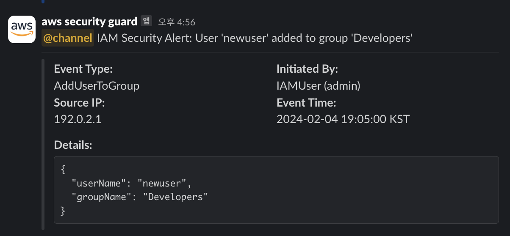

# 🛡️ AWS Security Monitoring - Multi-Region Solution

[](https://aws.amazon.com/cloudformation/)
[](README.md)

Real-time AWS security monitoring solution that sends instant Slack notifications for critical security events across all regions. Deploy with just 2 commands!

## Example



## 🏗️  Architecture


```
┌─────────────────────────────────────────────────────────────┐
│                    us-east-1 (Primary)                     │
│  ┌────────────┐ ┌─────────────┐ ┌─────────────────────────┐ │
│  │ CloudTrail │→│ S3 + KMS    │ │    Lambda Functions     │ │
│  │Multi-Region│ │ Secure Logs │ │ ┌─────────────────────┐ │ │
│  └────────────┘ └─────────────┘ │ │ IAM │Console│EC2    │ │ │
│                                 │ │Secrets│RDS Handler  │ │ │
│  ┌─────────────────────────────┐ │ └─────────────────────┘ │ │
│  │    Security EventBus        │ └─────────────────────────┘ │
│  └─────────────────────────────┘              │             │
└─────────────────────────────────────────────────┼─────────────┘
                                               │
                                          ┌────▼────┐
                                          │  Slack  │
                                          │Webhook  │
                                          └─────────┘
┌─────────────────────────────────────────────────────────────┐
│              ap-northeast-2 (Regional)                     │
│                                                             │
│  ┌─────────────────────────────────────────────────────┐   │
│  │            EventBridge Rules                        │   │
│  │  ┌─────────┐ ┌──────────────────┐ ┌─────────────┐   │   │
│  │  │   EC2   │ │ Secrets Manager  │ │     RDS     │   │   │
│  │  │  Rule   │ │      Rule        │ │    Rule     │   │   │
│  │  └─────────┘ └──────────────────┘ └─────────────┘   │   │
│  └─────────────────┬───────────────────────────────────┘   │
│                    │ Cross-Region Forward                  │
└────────────────────┼───────────────────────────────────────┘
                     │
                     ▲
```


## 🚀 Quick Start

### Prerequisites
- AWS CLI configured with appropriate permissions
- Slack webhook URL ([Setup Guide](https://api.slack.com/messaging/webhooks))

### Two-Command Deployment

```bash
# 1. Deploy Primary Region (us-east-1)
aws cloudformation deploy \
  --template-file multi-region-security-monitoring.yaml \
  --stack-name aws-security-monitoring \
  --parameter-overrides \
    SlackWebhookUrl="https://hooks.slack.com/services/YOUR/SLACK/WEBHOOK" \
    AllowedIpAddresses="192.168.1.1" \
    DeploymentType="Primary" \
  --capabilities CAPABILITY_NAMED_IAM \
  --region us-east-1

# 2. Deploy Regional (any additional region)
aws cloudformation deploy \
  --template-file multi-region-security-monitoring.yaml \
  --stack-name aws-security-monitoring-regional \
  --parameter-overrides \
    SlackWebhookUrl="https://hooks.slack.com/services/YOUR/SLACK/WEBHOOK" \
    AllowedIpAddresses="192.168.1.1" \
    DeploymentType="Regional" \
    PrimaryRegion="us-east-1" \
  --capabilities CAPABILITY_NAMED_IAM \
  --region ap-northeast-2
```


## 📋 Monitored Events

| **Service** | **Events** | **Risk Level** | **Trigger Conditions** |
|-------------|------------|----------------|-------------------------|
| **🔑 IAM** | User/Policy changes, Access Keys | 🔴 High | Unauthorized IP, Privilege escalation |
| **🖥️ Console** | Login attempts (success/failure) | 🟡 Medium | Root login, No MFA, Unknown IP |
| **🔐 Secrets Manager** | Secret access/modification | 🔴 Critical | Policy changes, Value retrieval |
| **🖥️ EC2** | Security Group changes, SSH access | 🟠 High | 0.0.0.0/0 rules, Instance Connect |
| **💾 RDS** | HTTP Endpoint exposure | 🔴 Critical | Data API enablement |

## ⚙️ Configuration Options

### 📊 Template Parameters

| Parameter | Description | Default | Example |
|-----------|-------------|---------|---------|
| `SlackWebhookUrl` | Slack webhook for notifications | **Required** | `https://hooks.slack.com/services/...` |
| `AllowedIpAddresses` | Trusted IPs (no channel alerts) | `127.0.0.1` | `192.168.1.1,10.0.0.1,203.0.113.1` |
| `DeploymentType` | Primary or Regional deployment | `Primary` | `Primary` / `Regional` |
| `PrimaryRegion` | Central processing region | `us-east-1` | `us-east-1` |
| `S3BucketSuffix` | CloudTrail S3 bucket suffix | `security` | `security-prod` |
| `TrailName` | CloudTrail name | `security-cloudtrail` | `security-trail-prod` |

### 🗂️ CloudTrail Configuration

<details>
<summary><strong>📁 S3 Bucket Settings</strong></summary>

```yaml
CloudTrailS3Bucket:
  Properties:
    BucketName: !Sub cloudtrail-${AWS::AccountId}-${S3BucketSuffix}
    
    # 🔒 Security Settings
    BucketEncryption:
      ServerSideEncryptionConfiguration:
        - ServerSideEncryptionByDefault:
            SSEAlgorithm: AES256        # Change to aws:kms for KMS encryption
            KMSMasterKeyID: !Ref KMSKey # Uncomment for KMS
    
    # 🚫 Access Control  
    PublicAccessBlockConfiguration:
      BlockPublicAcls: true             # Prevent public ACLs
      IgnorePublicAcls: true           # Ignore existing public ACLs
      BlockPublicPolicy: true          # Block public bucket policies
      RestrictPublicBuckets: true      # Restrict public bucket access
    
    # 📚 Versioning
    VersioningConfiguration:
      Status: Enabled                  # Change to Suspended to disable
    
    # 🗄️ Lifecycle Management (Add if needed)
    # LifecycleConfiguration:
    #   Rules:
    #     - Id: DeleteOldLogs
    #       Status: Enabled
    #       ExpirationInDays: 365      # Delete logs after 1 year
    #       Transitions:
    #         - TransitionInDays: 30
    #           StorageClass: STANDARD_IA
    #         - TransitionInDays: 90
    #           StorageClass: GLACIER
```

**Customization Options:**
- **🔐 Encryption**: Switch from AES256 to KMS for advanced key management
- **📅 Retention**: Add lifecycle rules for automatic log cleanup
- **💰 Cost Optimization**: Configure storage class transitions
- **📍 Naming**: Modify bucket naming pattern for your organization

</details>

<details>
<summary><strong>🔍 CloudTrail Advanced Settings</strong></summary>

```yaml
CloudTrail:
  Properties:
    TrailName: !Sub ${TrailName}-${AWS::StackName}
    S3BucketName: !Ref CloudTrailS3Bucket
    
    # 📊 Logging Configuration
    IsLogging: true                     # Enable/disable logging
    IsMultiRegionTrail: true           # Capture all regions
    IncludeGlobalServiceEvents: true   # Include IAM, CloudFront, Route53
    EnableLogFileValidation: true      # Integrity checking
    
    # 🔑 Encryption
    KMSKeyId: !Ref CloudTrailKMSKey   # Remove for S3-managed encryption
    
    # 🎯 Event Filtering
    AdvancedEventSelectors:
      - Name: Management events selector
        FieldSelectors:
          - Field: eventCategory
            Equals: [Management]
          # Add additional selectors:
          # - Field: eventName
          #   NotEquals: ["DescribeInstances", "ListObjects"]
          # - Field: eventSource
          #   Equals: ["ec2.amazonaws.com", "iam.amazonaws.com"]
    
    # 📝 SNS Integration (Optional)
    # SNSTopicName: !Ref CloudTrailTopic
    
    # 📊 CloudWatch Integration (Optional)
    # CloudWatchLogsLogGroupArn: !GetAtt LogGroup.Arn
    # CloudWatchLogsRoleArn: !GetAtt CloudWatchRole.Arn
```

**Customization Options:**
- **🔍 Event Filtering**: Fine-tune which events to capture
- **📊 CloudWatch**: Enable CloudWatch Logs integration
- **📧 SNS**: Add SNS notifications for trail delivery
- **🌐 Regional**: Switch to single-region trail for cost savings

</details>

### ⚡ Lambda Functions Configuration

<details>
<summary><strong>🛠️ Runtime & Performance Settings</strong></summary>

```yaml
# Global Lambda Configuration
Runtime: python3.10                   # python3.11, python3.12 available
Timeout: 30                           # Seconds (max 900)
MemorySize: 128                       # MB (128-10240, 64MB increments)

# Environment Variables
Environment:
  Variables:
    HOOK_URL: !Ref SlackWebhookUrl
    ALLOWED_IP: !Ref AllowedIpAddresses
    # Add custom variables:
    # LOG_LEVEL: INFO
    # RETRY_COUNT: 3
    # TIMEOUT_SECONDS: 10

# Function-Specific Overrides (example)
IAMEventHandlerFunction:
  Properties:
    Timeout: 60                       # Longer timeout for complex IAM events
    MemorySize: 256                   # More memory for large IAM policies
    
EC2EventHandlerFunction:
  Properties:
    ReservedConcurrencyConfiguration:
      ReservedConcurrency: 5          # Limit concurrent executions
```

**Performance Tuning:**
- **⚡ Memory**: Increase for faster execution
- **⏱️ Timeout**: Adjust based on Slack response times
- **🔄 Concurrency**: Set reserved concurrency for cost control
- **📊 Monitoring**: Add X-Ray tracing for debugging

</details>

<details>
<summary><strong>🔐 IAM Permissions & Security</strong></summary>

```yaml
LambdaExecutionRole:
  Properties:
    ManagedPolicyArns:
      - arn:aws:iam::aws:policy/service-role/AWSLambdaBasicExecutionRole
    
    # Custom Policies (if needed)
    Policies:
      - PolicyName: CustomLoggingPolicy
        PolicyDocument:
          Statement:
            - Effect: Allow
              Action:
                - logs:CreateLogGroup
                - logs:CreateLogStream
                - logs:PutLogEvents
                # - secretsmanager:GetSecretValue  # For webhook secrets
                # - kms:Decrypt                    # For encrypted parameters
              Resource: "*"

# VPC Configuration (if required)
# VpcConfig:
#   SecurityGroupIds: 
#     - !Ref LambdaSecurityGroup
#   SubnetIds: 
#     - !Ref PrivateSubnet1
#     - !Ref PrivateSubnet2
```

**Security Enhancements:**
- **🔐 Secrets**: Store webhook URL in AWS Secrets Manager
- **🌐 VPC**: Deploy in VPC for network isolation
- **🛡️ Security Groups**: Restrict outbound traffic
- **📝 Least Privilege**: Minimize IAM permissions

</details>

### 📡 EventBridge Configuration

<details>
<summary><strong>🎯 Event Pattern Customization</strong></summary>

```yaml
# Example: Customize IAM Events
IAMEventRule:
  Properties:
    EventPattern:
      source: ["aws.iam"]
      detail-type: ["AWS API Call via CloudTrail"]
      detail:
        eventSource: ["iam.amazonaws.com"]
        eventName: [
          "CreateUser", "DeleteUser",
          "AttachUserPolicy", "DetachUserPolicy",
          # Add/remove events as needed:
          # "CreateRole", "DeleteRole",
          # "PutUserPolicy", "DeleteUserPolicy"
        ]
        # Additional filters:
        # userIdentity:
        #   type: ["IAMUser", "Root"]
        # requestParameters:
        #   userName: [{"exists": true}]
```

**Advanced Filtering:**
- **👤 User Types**: Filter by Root, IAMUser, AssumedRole
- **📍 Regions**: Limit to specific regions
- **🔍 Parameters**: Filter by request parameters
- **⏰ Time Windows**: Add time-based conditions

</details>

<details>
<summary><strong>🌍 Cross-Region Event Routing</strong></summary>

```yaml
# Regional Event Rules (Forward to Primary)
EC2EventRule:
  Condition: IsRegionalOnly
  Properties:
    EventBusName: default
    Targets:
      - Id: EC2CrossRegionTarget
        Arn: !Sub arn:aws:events:${PrimaryRegion}:${AWS::AccountId}:event-bus/security-event-bus
        RoleArn: !GetAtt CrossRegionEventRole.Arn
        
        # Transformation (Optional)
        # HttpParameters:
        #   HeaderParameters:
        #     X-Source-Region: ap-northeast-2
        # InputTransformer:
        #   InputPathsMap:
        #     region: "$.detail.awsRegion"
        #   InputTemplate: |
        #     {
        #       "source-region": "<region>",
        #       "event": <aws.events.event>
        #     }
```

**Routing Options:**
- **🔄 Event Transformation**: Modify events during routing
- **📊 Dead Letter Queues**: Handle failed deliveries
- **⚡ Retry Logic**: Configure retry attempts
- **📈 Metrics**: Add custom CloudWatch metrics

</details>


## 🔧 Troubleshooting

### Common Issues

<details>
<summary><strong>❌ Stack Creation Failed</strong></summary>

**Error**: `The resource CloudTrailS3Bucket is in a CREATE_FAILED state`

**Solutions**:
1. **Bucket name conflict**: Change `S3BucketSuffix` parameter
2. **Permission issues**: Ensure AWS CLI has sufficient permissions
3. **Region availability**: Some services not available in all regions

```bash
# Check bucket availability
aws s3api head-bucket --bucket cloudtrail-123456789012-security 2>/dev/null || echo "Bucket available"

# Validate template
aws cloudformation validate-template --template-body file://multi-region-security-monitoring.yaml
```

</details>

<details>
<summary><strong>🔇 No Slack Notifications</strong></summary>

**Troubleshooting Steps**:

1. **Test Webhook URL**:
```bash
curl -X POST -H 'Content-type: application/json' \
  --data '{"text":"Test from AWS Security Monitoring"}' \
  YOUR_SLACK_WEBHOOK_URL
```

2. **Check Lambda Logs**:
```bash
aws logs filter-log-events \
  --log-group-name "/aws/lambda/IAMEventHandler" \
  --start-time $(date -d "1 hour ago" +%s)000 \
  --region us-east-1
```

3. **Verify EventBridge Rules**:
```bash
aws events list-rules --region us-east-1
aws events list-targets-by-rule --rule IAMEventRule --region us-east-1
```

4. **Test Lambda Function**:
```bash
aws lambda invoke \
  --function-name IAMEventHandler \
  --payload '{"Records":[{"eventSource":"aws:iam","eventName":"CreateUser"}]}' \
  response.json
```

</details>

<details>
<summary><strong>🌐 Cross-Region Issues</strong></summary>

**Common Problems**:
- Regional stack deployed before Primary
- Cross-region IAM role permissions
- EventBus not accessible

**Solutions**:
```bash
# Verify EventBus exists
aws events describe-event-bus --name security-event-bus --region us-east-1

# Check cross-region role
aws iam get-role --role-name aws-security-monitoring-regional-cross-region-role

# Test cross-region permissions
aws events put-events \
  --entries Source=test,DetailType=test,Detail='{}' \
  --endpoint-url https://events.us-east-1.amazonaws.com \
  --region ap-northeast-2
```

</details>


## 📊 Estimated Cost

### Estimated Monthly Costs (us-east-1)

| Service | Usage | Cost |
|---------|-------|------|
| CloudTrail | 1 trail | $2.00 |
| S3 Storage | 1GB logs/month | $0.02 |
| Lambda | 1000 invocations | $0.20 |
| EventBridge | 1M events | $1.00 |
| **Total** | | **~$3.22/month** |

### Cost Reduction Tips

1. **Log Lifecycle**: Implement S3 lifecycle policies
2. **Event Filtering**: Reduce unnecessary Lambda invocations
3. **Reserved Concurrency**: Prevent cost spikes
4. **Regional Selection**: Deploy only in required regions


## 🚀 What's Next?
- [ ] **Scalability**: Make easy to scale more event with lambda functions 
- [ ] **Enhanced Filtering**: Custom event filtering rules
- [ ] **Response Automation**: Auto-remediation for common issues

## 📄 Terms of Use

- **Free to use and modify** for your AWS environments
- **Community contributions** welcome via GitHub issues/PRs

## 🤝 Contributing

1. Fork this repository
2. Create a feature branch (`git checkout -b feature/amazing-feature`)
3. Commit your changes (`git commit -m 'Add some amazing feature'`)
4. Push to the branch (`git push origin feature/amazing-feature`)
5. Create a Pull Request

## ❓ FAQ

<details>
<summary><strong>Q: Can I add custom event sources?</strong></summary>

A: Yes! Add new EventBridge rules and Lambda functions:

1. Copy existing handler (e.g., `EC2EventHandler`)
2. Modify event pattern in the template
3. Update Lambda code for new service
4. Redeploy stack

</details>

<details>
<summary><strong>Q: How do I modify alert messages?</strong></summary>

A: Edit the Lambda function code in the YAML template. Look for the `create_base_slack_message` and `add_fields_to_message` methods.

</details>

<details>
<summary><strong>Q: Can I use Microsoft Teams instead of Slack?</strong></summary>

A: Yes! Change the webhook URL format and modify the message payload structure in the Lambda code.

</details>

<details>
<summary><strong>Q: How do I exclude certain events?</strong></summary>

A: Modify the EventPattern in the EventBridge rules to exclude specific events or add filters in the Lambda code.

</details>

<details>
<summary><strong>Q: Is this production-ready?</strong></summary>

A: Yes, with additional considerations:
- Store webhook URLs in Secrets Manager
- Add comprehensive error handling
- Implement proper monitoring and alerting
- Regular security reviews and updates

</details>