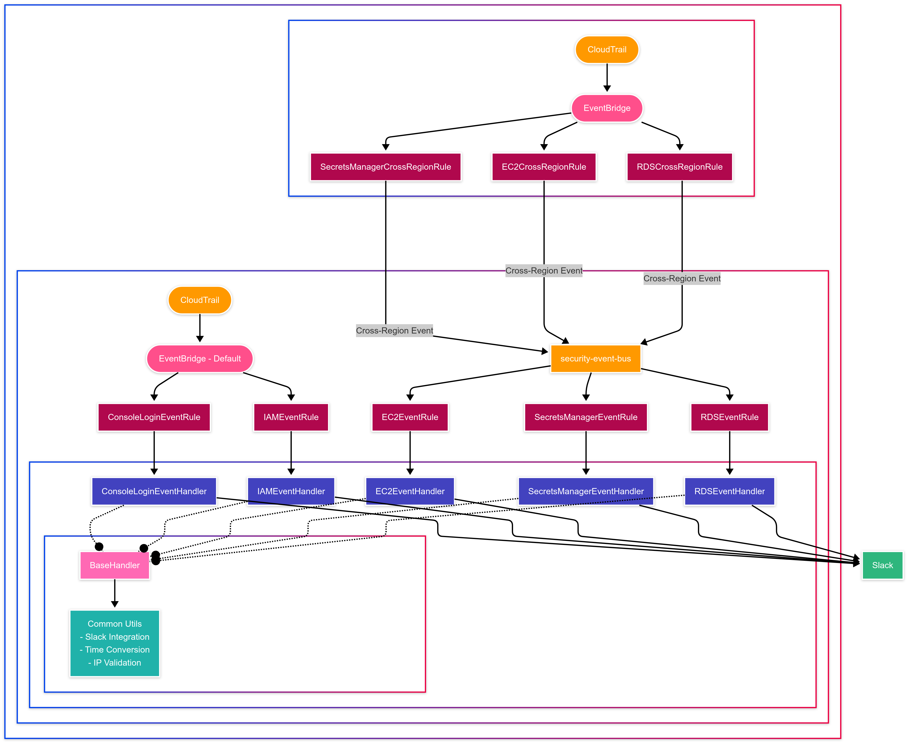

# AWS Security Monitoring Solution

This CloudFormation-based solution implements a comprehensive security monitoring system for AWS, combining CloudTrail, EventBridge, and Lambda to detect and alert on suspicious activities across multiple AWS regions.

## Architecture




## Features

- **Multi-Region Monitoring**: Central collection of security events from all AWS regions
- **Real-time Alerts**: Immediate Slack notifications for critical security events
- **Cross-Account Support**: Deploy across multiple AWS accounts with consistent configuration
- **Customizable Filtering**: Focus on the security events that matter to your organization
- **Comprehensive Coverage**: Monitors IAM, Console Logins, Secrets Manager, EC2, and RDS activities

## Monitored Events

| Service | Events |
|---------|--------|
| **IAM** | CreateUser, DeleteUser, UpdateUser, AddUserToGroup, RemoveUserFromGroup, etc. |
| **Console** | Login events, including failed attempts |
| **Secrets Manager** | CreateSecret, DeleteSecret, GetSecretValue, PutResourcePolicy, etc. |
| **EC2** | SecurityGroup changes, Instance Connect, SSH access |
| **RDS** | HTTP Endpoint exposure |

## Prerequisites

- An AWS account with CloudFormation permissions
- A Slack workspace with webhook URL for notifications
- Git and AWS CLI installed locally

## Deployment

The deployment consists of two main parts:
1. CloudTrail configuration for security logging and S3 Bucket for store logs
2. Security monitoring system (EventBridge, Lambda Functions)

## Deployment Instructions
1. Clone this repository:
   ```bash
   git clone https://github.com/your-username/aws-security-audit-trail.git
   cd aws-security-audit-trail
   ```
2. Deploy the CloudFormation stack:
   ```bash
   aws cloudformation deploy \
     --template-file templates/cloudtrail.yaml \
     --stack-name security-cloudtrail \
     --parameter-overrides \
       TrailName=cloudtrail-security-logs \
       S3BucketSuffix=security \
     --capabilities CAPABILITY_NAMED_IAM \
     --region ap-northeast-2
   ```

## Parameter Details
| Parameter | Description | Default Value |
|----------|------|--------|
| `TrailName` | CloudTrail trail name | cloudtrail-logs |
| `S3BucketSuffix` | S3 bucket name suffix<br>Final bucket name: aws-cloudtrail-logs-{AccountID}-{suffix} | b74020e1 |

## Customization Options
### Deploying to Different Regions
Change the `--region` parameter in the deployment command to deploy to your desired region:
```bash
--region us-east-1  # US East (Virginia)
--region ap-northeast-2  # Asia Pacific (Seoul)
```

### Modifying Advanced Event Selectors
Edit the `AdvancedEventSelectors` section in the template to apply various filtering rules:
```yaml
AdvancedEventSelectors:
  - Name: "S3 events only"
    FieldSelectors:
      - Field: eventCategory
        Equals:
          - Management
      - Field: eventSource
        Equals:
          - s3.amazonaws.com
```

## Validation Methods
After deployment, verify your setup with:
```bash
# Check CloudTrail configuration
aws cloudtrail describe-trails --region ap-northeast-2

# Verify event selectors
aws cloudtrail get-event-selectors --trail-name cloudtrail-security-logs --region ap-northeast-2

# Confirm advanced event selectors
aws cloudtrail get-event-selectors --trail-name cloudtrail-security-logs --region ap-northeast-2
```

## Contributing
1. Fork this repository
2. Create a feature branch (`git checkout -b feature/amazing-feature`)
3. Commit your changes (`git commit -m 'Add some amazing feature'`)
4. Push to the branch (`git push origin feature/amazing-feature`)
5. Create a Pull Request

